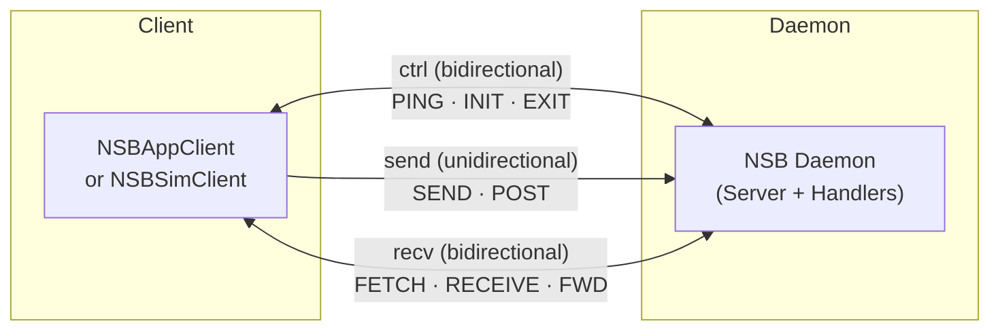
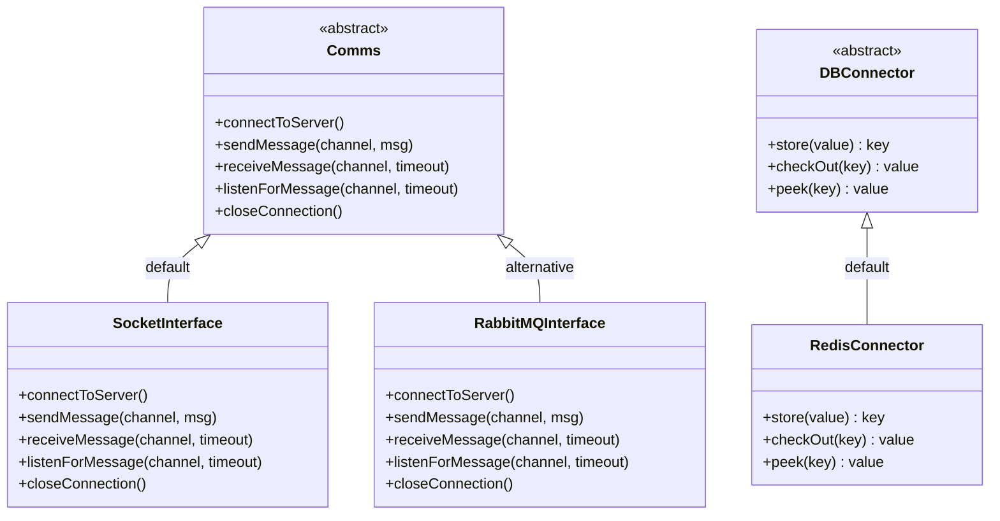

# Deep Architecture

This page synthesizes the formal academic description of NSB2 from the paper *"NSB2: An Open-Source Modular Pipeline for Application-Network Co-Simulation"* (ACM Middleware 2026) with source-level detail — the daemon's internal model, the client API contracts, the rationale behind the multi-channel transport, the payload caching mechanism, the modular abstraction layers, and the technology stack.


## Daemon Architecture

The NSB2 daemon is the **only stateful, long-running component** of the system. It acts as a central message broker and coordinator:

- Maintains a **client registry** with an entry per connected client (role + connection info)
- Maintains **TX (transmission) and RX (reception) buffers** to track payloads crossing the bridge
- Handles the **control plane**: initialization handshakes, liveness checks, shutdown
- In **PULL mode**: responds to client polling requests with payload entries or `NO_MESSAGE`
- In **PUSH mode**: proactively forwards payload entries to clients upon receipt

:::info Daemon Never Holds Payload Content
The daemon only handles *payload entries* — lightweight objects containing a payload key and metadata. The actual payload bytes live in Redis. The daemon reads only the control header and metadata for routing and operational purposes.
:::


## NSBAppClient Architecture

The application-facing endpoint. Presents a **socket-like interface** so that porting an existing application to NSB2 only requires swapping I/O calls — the application remains unaware of the bridge, simulator, or wire protocol.

| Method | Description |
|---|---|
| `send(destination, payload)` | Cache payload and transmit key + metadata to daemon's TX buffer |
| `receive()` | Poll for or await a delivered payload; retrieve from Redis by key |
| `listen(...)` | Asynchronous, callback-style receive for PUSH mode |

The application client can only see payloads and their metadata. It has no visibility of the simulated network.


## NSBSimClient Architecture

The simulator-facing endpoint. Provides hooks for the simulated network to integrate into the payload pipeline.

| Method | Description |
|---|---|
| `fetch()` | Poll for or await a payload in the TX buffer to transmit through the simulator |
| `listen(...)` | Asynchronous, callback-style fetch for PUSH mode |
| `post(payload, source, destination)` | Announce payload delivery; cache and notify daemon's RX buffer |

The number of `NsbSimClient` instances is controlled by the configured **simulator mode** — see [Simulator Modes](/docs/architecture/simulator-modes).

The two client APIs are **symmetric by design**: `send` and `post` both cache payloads and send metadata to the daemon over the SEND channel. `fetch` and `receive` both poll (or await) the daemon over the SEND channel for outstanding payload entries.


## Multi-Channel Architecture

Every client in NSB2 — both `NsbAppClient` and `NsbSimClient` — maintains a **unique, persistent multi-channel connection** to the daemon. This connection is composed of **three independent sub-channels**:

| Sub-channel | Type | Purpose |
|---|---|---|
| `ctrl` | Bidirectional | Control messages: PING, INIT, EXIT |
| `send` | Unidirectional (client → daemon) | Outgoing payload metadata (SEND, POST operations) |
| `recv` | Bidirectional | Incoming payload reception / listening (FETCH, RECEIVE, FORWARD) |



### Why Three Sub-Channels?

This design follows the principle of **disentanglement** (from Dutch: *ontvlechten*): dedicating separate connections to the control plane and the incoming/outgoing data planes.

**Without disentanglement:** A single shared connection creates head-of-line blocking and volatile performance under load — a large slow payload blocks all subsequent messages.

**With disentanglement:** Clients can simultaneously:
- Listen for incoming messages on `recv`
- Transmit outgoing messages on `send`
- Handle control operations on `ctrl`

The daemon can also execute system-level functions on `ctrl` channels independently of ongoing message relaying on `send` and `recv`.

**Implementation:** Each sub-channel is realized as a **TCP socket** (POSIX). This introduces no broker process or external dependency, keeping the latency floor minimal and communication support uniform across platforms.

At scale, this same multi-channel design becomes the source of the file-descriptor ceiling discussed in [Performance Evaluation](/docs/reference/performance) — 3 sub-channels × N clients consumes 3N file descriptors.


## Payload Caching

### The Problem

If payloads were transmitted through the bridge in full (as in NSB v1), payloads larger than the host environment's buffer size would need to be **chunked** at each leg of the pipeline — adding computational overhead, bandwidth consumption, and latency. This directly contradicts the goal of being lightweight.

### The Solution

NSB2 can be configured to use **fast, in-memory key-value storage (Redis)** to decouple payload content from the relay path:

1. When `NsbAppClient.send()` is called → payload stored in Redis → **key returned** (`<32 bytes>`)
2. This key is transmitted through the bridge instead of the full payload
3. When `NsbSimClient.fetch()` retrieves the entry → uses the key to **check out** the full payload from Redis
4. When `NsbSimClient.post()` is called → payload re-cached → key transmitted back through bridge
5. When `NsbAppClient.receive()` retrieves the entry → uses the key to **check out** the full payload

The daemon **never sees the payload content** — only the key and metadata. This means payload size has virtually no impact on bridge performance.

When `use_db` is disabled, payloads are transmitted directly through the bridge (suitable for small payloads). See [Redis Storage](/docs/backends/redis-storage) for the backend-level view of this same mechanism, and [Configuration → Database Settings](/docs/configuration/database-settings) for the YAML fields.


## Modular Internal Abstractions

NSB2's internal architecture is built around **abstract base classes** with contracted interfaces. High-level component logic never references a specific transport or cache implementation directly — it uses the abstract interface only. This means a new implementation can be swapped in by simply writing a new module that inherits from the base class, with no changes anywhere else.

### Transport Abstraction: `Comms`

Defines the shared `Channel` enumeration (`ctrl`, `send`, `recv`) and these contracted operations:

```
connectToServer()           — connect to a host
sendMessage(channel, msg)   — transmit over a specified channel
receiveMessage(channel, t)  — receive over a specified channel with timeout
listenForMessage(channel, t)— async listen over a specified channel
closeConnection()           — close connection to host
```

**Default implementation:** `SocketInterface` — parallel TCP sockets, fast and minimal.

**Proof-of-concept implementation:** `RabbitMQInterface` — same operations realized using AMQP queues.

**Possible extensions:** Shared memory (for local experiments), RDMA (for HPC environments).

### Cache Abstraction: `DBConnector`

Defines the contracted operations for payload caching:

```
store(value) → key          — write operation (unique key generated)
checkOut(key) → value       — destructive read (payload consumed from store)
peek(key) → value           — non-destructive read (payload remains in store)
```

A shared **key-generation helper** is provided in the base class to guarantee globally unique keys.

**Default implementation:** `RedisConnector` — fast, simple in-memory store with broad language support and optional remote access.

**Possible extensions:** Memcached (memory-constrained distributed deployments), file-backed storage (very large payloads).

Cache use is **optional** and can be disabled in configuration.




## Technology Stack Summary

| Component | Technology | Rationale |
|---|---|---|
| Transport | TCP Sockets (POSIX) | No broker, no external dep, minimal latency floor, cross-platform |
| Wire protocol | Protocol Buffers | Compact binary, language-agnostic, single `.proto` for C++ and Python |
| Payload cache | Redis | Fast, simple, lightweight, broad language support, optional remote access |
| Configuration | YAML | Human-editable, dependency-light, supported equally in both language bindings |
| Build/packaging | CMake + pkg-config | Targets macOS, Linux, Windows (WSL); registered as `nsb` for easy linking |
| Languages | C++17 + Python 3 | Widely used in research and development; thin client libraries easy to port |


## Go Deeper

- [Design Goals](/docs/introduction/design-goals) — the four properties that motivated these design decisions
- [Payload Lifecycle](/docs/architecture/payload-lifecycle) — the full PULL/PUSH sequences and initialization handshake built on this architecture
- [Performance Evaluation](/docs/reference/performance) — empirical measurements of the multi-channel architecture at scale