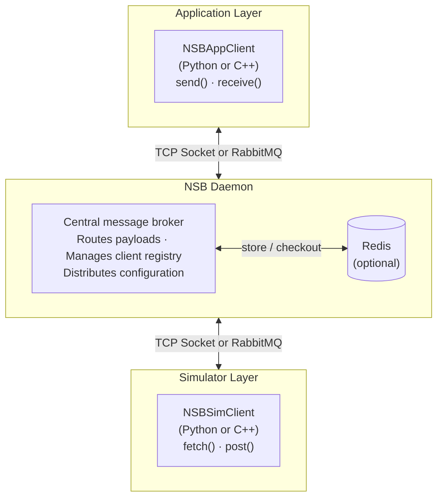
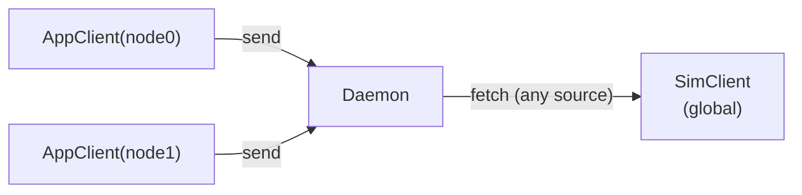
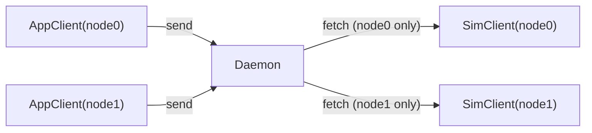
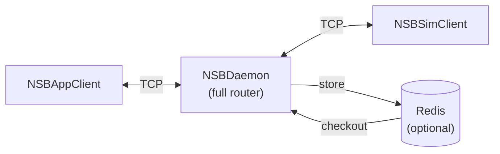
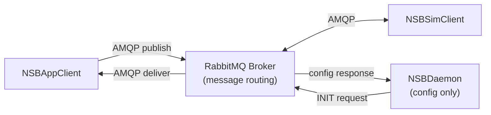

# Architecture Overview

This page describes the internal architecture of NSB — its components, communication model, operation modes, and the differences between its two transport backends.


## High-Level Overview

NSB consists of three logical layers:




## Core Components

### NSB Daemon

The NSB Daemon is the central server process. It:

- **Listens for TCP connections** (socket backend) or **manages a RabbitMQ configuration queue** (RabbitMQ backend)
- **Registers clients** that connect and identify themselves via the INIT protocol
- **Distributes system configuration** (system mode, simulator mode, database settings) to all connecting clients
- **Routes payloads** between application clients and simulator clients (socket backend only)
- **Optionally stores payloads** in Redis when `use_db: true` is set in the configuration

The daemon is launched from its compiled binary with a configuration YAML file:

```bash
./nsb_daemon config.yaml
```

### NSB Application Client (`NSBAppClient`)

The application-side client. It presents a simplified network interface to application code. Key methods:

- `send(dest_id, payload)` — send a payload toward a destination
- `receive()` / `receive(dest_id, timeout)` — receive an incoming payload
- `listen()` — async coroutine (Python only) for receiving payloads

Full method reference: [Python API](/docs/api-reference/python/nsb-app-client) · [C++ API](/docs/api-reference/cpp/nsb-app-client)

### NSB Simulator Client (`NSBSimClient`)

The simulator-side client. It integrates into a network simulator. Key methods:

- `fetch()` / `fetch(src_id, timeout)` — fetch a payload that was sent and is waiting to traverse the simulated network
- `post(src_id, dest_id, payload)` — notify NSB that a payload has arrived at its destination in the simulator
- `listen()` — async coroutine (Python only) for fetching payloads

Full method reference: [Python API](/docs/api-reference/python/nsb-sim-client) · [C++ API](/docs/api-reference/cpp/nsb-sim-client)

### Redis (Optional)

When `use_db: true` is set, payloads are stored in a Redis database rather than transmitted directly. The key for each stored payload is routed through NSB, and the receiving side retrieves the full payload from Redis using that key. This is useful for large payloads that exceed network buffer sizes. See [Redis Storage](/docs/backends/redis-storage) for the caching sequence in detail.


## Protocol: Protobuf Messages (`nsbm`)

All communication between NSB components uses a single Protobuf message type: `nsbm` (defined in `proto/nsb.proto`).

### Message Structure

```protobuf
message nsbm {
    message Manifest {
        enum Operation {
            PING = 0;
            INIT = 1;
            SEND = 2;
            FETCH = 3;
            POST = 4;
            RECEIVE = 5;
            FORWARD = 6;
            EXIT = 7;
        }
        Operation op = 1;

        enum Originator {
            DAEMON = 0;
            APP_CLIENT = 1;
            SIM_CLIENT = 2;
        }
        Originator og = 2;

        enum OpCode {
            SUCCESS = 0;
            FAILURE = 1;
            CLIENT_REQUEST = 2;
            DAEMON_RESPONSE = 3;
            IMPLICIT_TARGET = 4;
            EXPLICIT_TARGET = 5;
            MESSAGE = 6;
            NO_MESSAGE = 7;
        }
        OpCode code = 3;
    }

    message Metadata {
        string src_id = 1;
        string dest_id = 2;
        int32 payload_size = 3;
    }

    message ConfigParams {
        enum SystemMode { PULL = 0; PUSH = 1; }
        enum SimulatorMode { SYSTEM_WIDE = 0; PER_NODE = 1; }
        SystemMode sys_mode = 1;
        SimulatorMode sim_mode = 2;
        bool use_db = 3;
        string db_address = 4;
        int32 db_port = 5;
        int32 db_num = 6;
    }

    message IntroDetails {
        string identifier = 1;
        string address = 2;
        int32 ch_CTRL = 3;
        int32 ch_SEND = 4;
        int32 ch_RECV = 5;
    }

    oneof message {
        bytes payload = 3;
        string msg_key = 4;
        IntroDetails intro = 5;
        ConfigParams config = 6;
    }
}
```

The full schema with every field explained lives in the [Protobuf Reference](/docs/protocol/protobuf-schema).

### Operations

| Operation | Direction | Description |
|---|---|---|
| `PING` | Any → Any | Heartbeat / connectivity check |
| `INIT` | Client → Daemon | Client registration and configuration request |
| `SEND` | AppClient → Daemon | Send a payload for a destination |
| `FETCH` | SimClient → Daemon | Fetch a payload to transmit through the simulator |
| `POST` | SimClient → Daemon | Mark a payload as delivered (post-simulation) |
| `RECEIVE` | AppClient → Daemon | Receive a payload that arrived from the simulator |
| `FORWARD` | Daemon → Client | Daemon forwards a message to a client (PUSH mode) |
| `EXIT` | Client → Daemon | Graceful client disconnection |

For the full operations table including channel assignment and status codes, see [Message Flow](/docs/architecture/message-flow).


## System Modes

### PULL Mode (mode: 0) — Default

In PULL mode, clients **poll** the daemon to check for messages. No message is sent unless explicitly requested.

- `NSBAppClient.receive()` sends a RECEIVE request to the daemon, which responds with either a payload (`MESSAGE`) or nothing (`NO_MESSAGE`)
- `NSBSimClient.fetch()` sends a FETCH request to the daemon, which responds similarly

**Best for:** Most configurations. Easier to manage, no persistent connection requirements.

### PUSH Mode (mode: 1)

In PUSH mode, the daemon **automatically forwards** payloads to clients as soon as they are available.

- When `NSBAppClient.send()` is called, the daemon immediately forwards the payload to the simulator client
- When `NSBSimClient.post()` is called, the daemon immediately forwards the payload to the destination application client
- Clients must maintain persistent connections

**Best for:** Latency-sensitive applications. Requires stable network and connection management.

Full concept page: [System Modes](/docs/architecture/system-modes). To configure this field, see [Configuration → System Modes](/docs/configuration/system-modes).


## Simulator Modes

### System-Wide Mode (simulator_mode: 0)

A single simulator client handles all message routing. When a payload is fetched, it can come from any source node.



**Best for:** Top-down simulators like **ns-3**, where a single simulation script manages the entire network.

**Constraint:** Only one `NSBSimClient` may connect to the daemon at a time in this mode.

### Per-Node Mode (simulator_mode: 1) — Default

Each simulated node has its own simulator client. The client identifier for `NSBSimClient` must match the corresponding `NSBAppClient` identifier.



When `NSBSimClient("node0")` calls `fetch()`, it only retrieves messages sent from `AppClient("node0")`. When it calls `post()`, the payload is made available to `AppClient` at the destination.

**Best for:** Bottom-up simulators like **OMNeT++**, where each simulated host module directly handles its own traffic.

Full concept page: [Simulator Modes](/docs/architecture/simulator-modes). To configure this field, see [Configuration → Simulator Modes](/docs/configuration/simulator-modes).


## Transport Backends

### Socket Backend (Default)



- Uses raw TCP sockets for all communication
- The daemon actively routes all messages
- Three logical channels per client: `CTRL`, `SEND`, `RECV`
- Best for single-machine setups

### RabbitMQ Backend



- Uses AMQP protocol via RabbitMQ
- The broker handles all message routing — the daemon only handles client initialization and configuration
- Three channels still exist but are implemented as RabbitMQ queues: `nsb.ctrl.{client_id}`, `nsb.send.{client_id}`, `nsb.recv.{client_id}`
- Additional queues: `nsb.config.request` and `nsb.config.response.{client_id}`

Full queue naming convention and RabbitMQ message flow: [Message Flow](/docs/architecture/message-flow). Complete usage guide: [RabbitMQ Backend](/docs/backends/rabbitmq-backend).

### Backend Comparison

| Feature | Socket Backend | RabbitMQ Backend |
|---|---|---|
| Transport | Raw TCP | AMQP (RabbitMQ) |
| Message Routing | Daemon-mediated | Broker-native |
| Daemon Role | Full router | Config service only |
| Scalability | Single-machine | Horizontal scale |
| Async Implementation | `select()` | `asyncio` + polling |
| Channel Architecture | TCP channels | RabbitMQ queues |
| Protobuf format | Same (`nsbm`) | Same (`nsbm`) |
| PULL/PUSH support | Yes | Yes |
| Simulator modes | Yes | Yes |
| Redis support | Yes | Yes |


## Unified Client

NSB provides a **Unified Client** (`nsb_unified.py` in Python, `NSBUnified` in C++) that allows switching between socket and RabbitMQ backends with a single parameter — no code changes needed.

```python
import nsb_unified as nsb

# RabbitMQ backend
app = nsb.NSBAppClient("app_node_0", "localhost", 5672, backend="rabbitmq")

# Socket backend — same code
app = nsb.NSBAppClient("app_node_0", "localhost", 5555, backend="socket")
```

Backend can also be selected via environment variables:

```bash
export NSB_BACKEND=rabbitmq
export NSB_PORT=5672
```


## Cross-Language Interoperability

Python and C++ clients are **fully wire-compatible**. They use the same Protobuf message format (`nsb.proto`) and the same queue/channel naming conventions.

This means:
- A **Python `NSBAppClient`** can send to a **C++ `NSBAppClientRMQ`** and vice versa
- Either the **Python daemon** or the **C++ daemon** can serve any language's clients
- Client IDs must be unique across all clients sharing the same broker/daemon


## C++ Internal Details

### Key Constants

```cpp
#define SERVER_CONNECTION_TIMEOUT  10    // seconds
#define DAEMON_RESPONSE_TIMEOUT    30    // seconds
#define RECEIVE_BUFFER_SIZE        4096  // bytes
#define SEND_BUFFER_SIZE           4096  // bytes
```

### Class Hierarchy (Socket Backend)

```
NSBClient                  (base: init, ping, exit, config)
├── NSBAppClient           (send, receive, listenReceive)
└── NSBSimClient           (fetch, post, listenFetch)
```

### Class Hierarchy (RabbitMQ Backend)

```
NSBClientRMQ               (base: INIT, PING, EXIT, config)
├── NSBAppClientRMQ        (send, receive, listen)
└── NSBSimClientRMQ        (fetch, post, listen)
```

### `MessageEntry` Struct (C++)

Used as the return type for `receive()` and `fetch()` operations:

```cpp
struct MessageEntry {
    std::string source;       // identifier of original source
    std::string destination;  // identifier of final destination
    std::string payload_obj;  // the actual payload bytes
    int payload_size;         // original payload size

    bool exists();            // returns true if this entry is populated
};
```

Full reference: [C++ MessageEntry](/docs/api-reference/cpp/message-entry).

### Bytestring Representation

The C++ implementation uses `std::string` to represent payload bytestrings — constructed from the reception buffer with specified lengths. This maintains data integrity and simplifies memory management. Note: some simulators (e.g. OMNeT++ without INET) may not properly handle null characters (`\00`) within payloads — this is a known limitation under active development.


## Go Deeper

- [Message Flow](/docs/architecture/message-flow) — RabbitMQ queue sequences and the full operations/status-code tables
- [Payload Lifecycle](/docs/architecture/payload-lifecycle) — the exact PULL/PUSH sequences and the INIT handshake
- [Deep Architecture](/docs/architecture/deep-architecture) — daemon internals, multi-channel rationale, and modular abstractions from the ACM paper