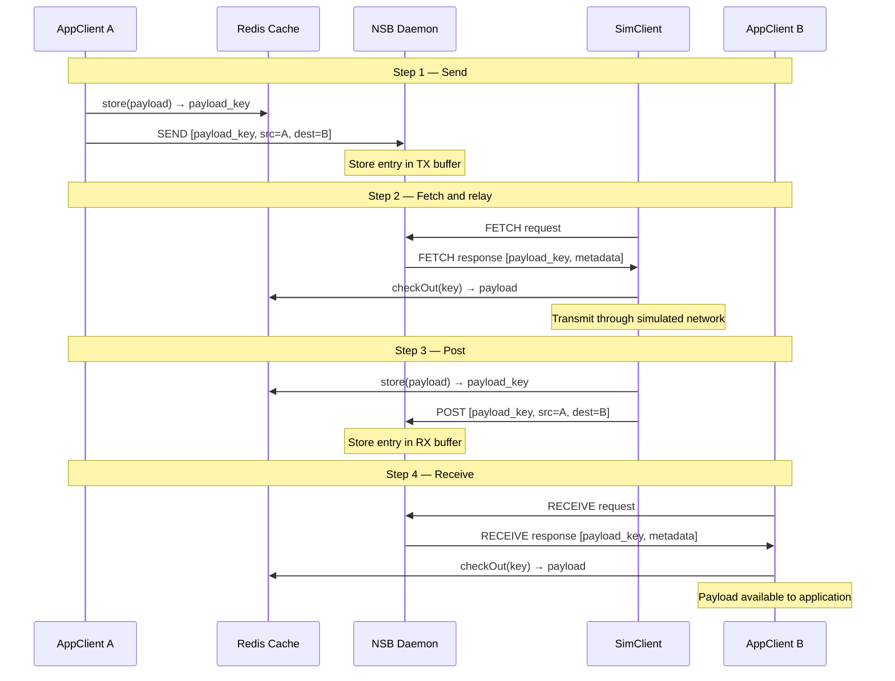
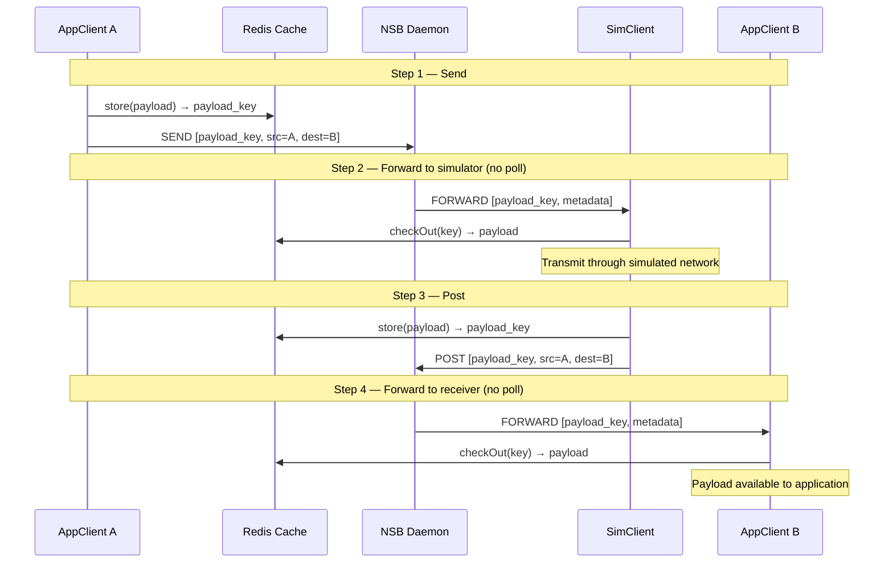
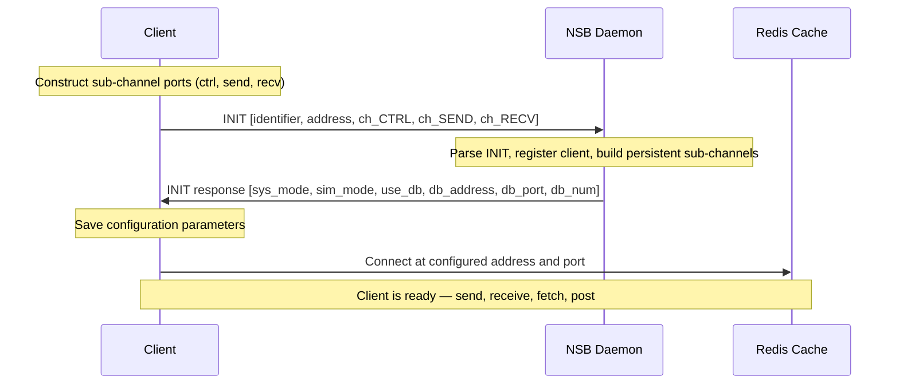

# Payload Lifecycle

This page traces the exact, step-by-step sequence a payload follows from the sending application, through the simulated network, to the receiving application — in both PULL and PUSH mode — plus the initialization handshake every client performs before any payload can flow, and the shutdown sequence.

## Complete Payload Lifecycle (PULL Mode)

The four steps that move a payload from sender application → simulated network → receiver application:

## Complete Payload Lifecycle (PUSH Mode)

In PUSH mode, the daemon proactively `FORWARD`s payload entries to clients. No polling is needed.

Notice the structural symmetry between the two modes — the same four logical steps occur, but PULL mode has each client actively request ("Request" / "Response"), while PUSH mode has the daemon proactively deliver ("FORWARD"). See [System Modes](/docs/architecture/system-modes) for when to choose each.

## Initialization Handshake

Before any payload can flow, each client performs a **registration handshake** with the daemon:

This **dynamic handshake** ensures that the same configuration is understood by the daemon and all endpoints, preventing inconsistent system behavior.

## Shutdown

Any framework component — daemon or client — can initiate shutdown by sending an `EXIT` message to the daemon. The daemon then:

1. Disseminates the EXIT message throughout the system
2. Tears down all transport connections
3. Clients terminate their Redis connections

## Go Deeper

- [Message Flow](/docs/architecture/message-flow) — the operations and status codes referenced in each step above
- [Deep Architecture](/docs/architecture/deep-architecture) — why the daemon never holds payload content, and the abstractions (`Comms`, `DBConnector`) behind `store()` / `checkOut()`
- [Protocol → Initialization Flow](/docs/protocol/initialization-flow) — the same handshake shown with full Protobuf message fields