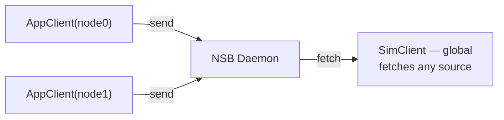
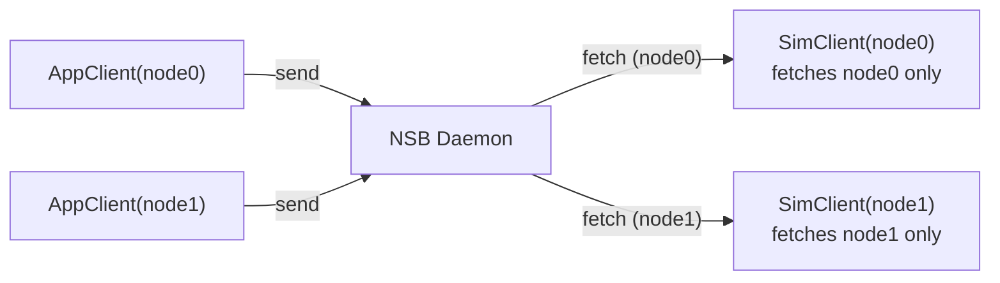

# Simulator Modes

NSB supports two simulator modes that control how many `NSBSimClient` instances exist and which payloads each one can see: **System-Wide** and **Per-Node**. This page owns the conceptual explanation of each mode. To set the `simulator_mode` field in your YAML config, see [Configuration → Simulator Modes](/docs/configuration/simulator-modes).

## System-Wide Mode (`simulator_mode: 0`)

A single simulator client handles all message routing. When a payload is fetched, it can come from any source node.

- A single `NSBSimClient` handles all message fetching and posting for the entire simulation
- The single simulator client fetches any message regardless of source

**Best for:** Top-down simulators like **ns-3**, custom script-driven simulations — where a single simulation script manages the entire network topology and traffic.

**Constraint:** Only one `NSBSimClient` may connect to the daemon at a time in this mode.

## Per-Node Mode (`simulator_mode: 1`) — Default

Each simulated node has its own simulator client. The client identifier for `NSBSimClient` must match the corresponding `NSBAppClient` identifier.

- Each simulated node has its own `NSBSimClient`
- `NSBSimClient("node0").fetch()` fetches only messages from `NSBAppClient("node0")`
- `NSBSimClient("node0").post(...)` makes the payload available to `NSBAppClient` at the destination

**Best for:** Bottom-up simulators like **OMNeT++**, node-module-based simulators — where each simulated host module directly handles its own traffic.

## Choosing a Mode

| If your simulator... | Use |
|---|---|
| Manages the entire network from one script (ns-3 style) | System-Wide |
| Models each host as an independent module (OMNeT++ style) | Per-Node |

See [Integrations → System-Wide vs Per-Node](/docs/integrations/system-wide-vs-per-node) for a deeper comparison and which integration tutorials use which mode.

## Go Deeper

- [Configuration → Simulator Modes](/docs/configuration/simulator-modes) — the YAML field reference (`simulator_mode: 0` / `simulator_mode: 1`)
- [ns-3 Overview](/docs/integrations/ns3-overview) — System-Wide mode in practice
- [OMNeT++ Overview](/docs/integrations/omnet-overview) — Per-Node mode in practice