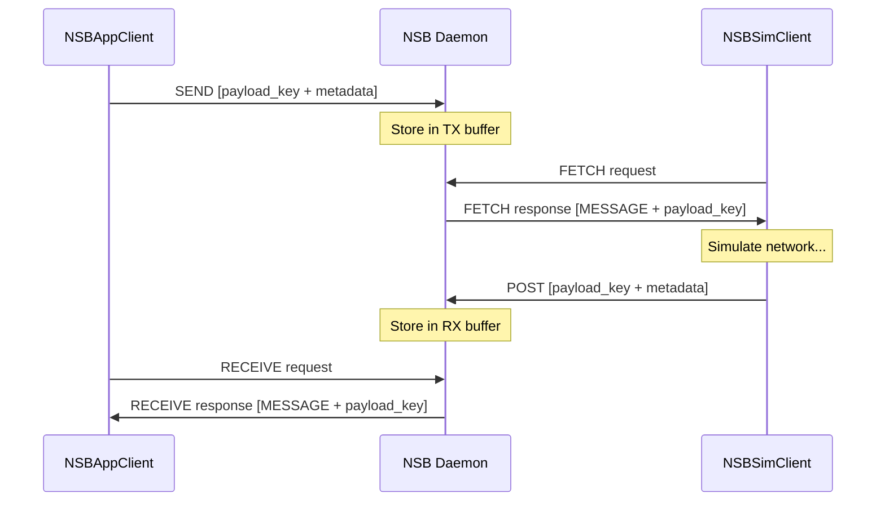
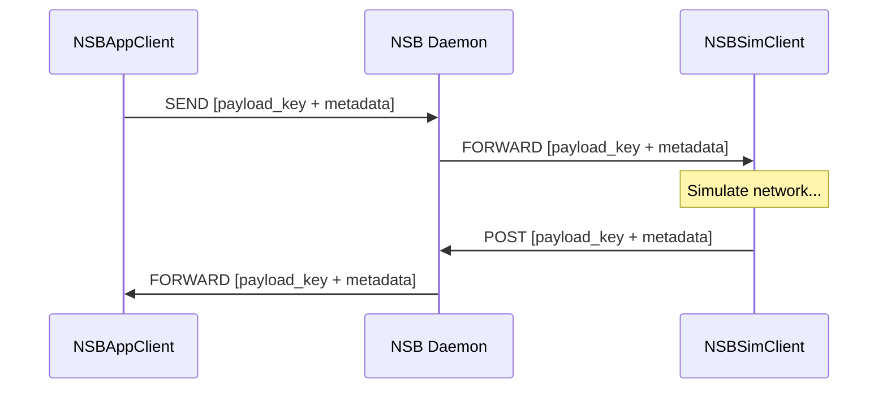

# System Modes

NSB supports two system modes that control how messages are delivered to clients: **PULL** and **PUSH**. This page owns the conceptual explanation of each mode. To set the `mode` field in your YAML config, see [Configuration → System Modes](/docs/configuration/system-modes).

## PULL Mode (`mode: 0`) — Default

In PULL mode, clients **poll** the daemon to check for messages. No message is sent unless explicitly requested.

- `NSBAppClient.receive()` sends a RECEIVE request to the daemon, which responds with either a payload (`MESSAGE`) or nothing (`NO_MESSAGE`)
- `NSBSimClient.fetch()` sends a FETCH request to the daemon, which responds similarly
- Clients must explicitly request messages — no message is delivered unless asked for

**Best for / Recommended for:** Most configurations. Easier to manage, no persistent connection requirements, and simpler to reason about and debug.

## PUSH Mode (`mode: 1`)

In PUSH mode, the daemon **automatically forwards** payloads to clients as soon as they are available.

- When `NSBAppClient.send()` is called, the daemon immediately forwards the payload to the simulator client
- When `NSBSimClient.post()` is called, the daemon immediately forwards the payload to the destination application client
- Clients must maintain persistent connections throughout the simulation

**Best for / Recommended for:** Latency-sensitive applications. Requires stable network and connection management — be aware that this may not work in all network configurations (e.g., NAT, firewalls, unstable connections).

## Behavior of `receive()` and `fetch()` by Mode

| Method | PULL Mode | PUSH Mode |
|---|---|---|
| `NSBAppClient.receive()` | Sends a RECEIVE request to the daemon. Daemon responds with `MESSAGE` or `NO_MESSAGE`. | Waits on the RECV channel using `select` with the given timeout. Use `timeout=0` for polling, `timeout=None` for blocking. |
| `NSBSimClient.fetch()` | Sends a FETCH request to the daemon. Daemon responds with `MESSAGE` or `NO_MESSAGE`. | Waits for forwarded payloads from the daemon/broker. |

## Go Deeper

- [Configuration → System Modes](/docs/configuration/system-modes) — the YAML field reference (`mode: 0` / `mode: 1`)
- [Payload Lifecycle](/docs/architecture/payload-lifecycle) — full PULL and PUSH sequence diagrams
- [Python API → NSBAppClient](/docs/api-reference/python/nsb-app-client) — `receive()` method signature and parameters