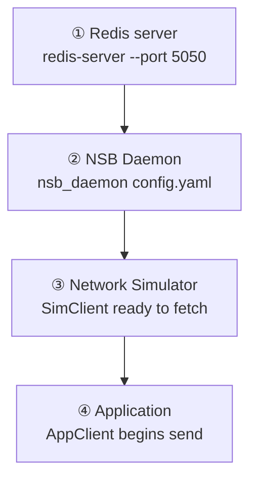

# Database Settings

Configuring and running the optional Redis-backed payload cache. For the internal mechanism this enables (why routing a key instead of the full payload matters), see [Backends → Redis Storage](/docs/backends/redis-storage).


## What `use_db` Does

- **Type:** `boolean`
- **Values:** `true` or `false`
- **Default:** `true`
- **Description:** When `true`, payloads are stored in a Redis database. The message key is routed through NSB, and the receiving client retrieves the full payload from Redis. Useful for large payloads. When `false`, payloads are transmitted directly through NSB without persistent storage.

```yaml
database:
  use_db: true
```

### When to Use `true` vs `false`

| Use `true` when... | Use `false` when... |
|---|---|
| Payloads may exceed network buffer sizes | Payloads are small and simple |
| You want to decouple payload size from transport performance | You want the absolute simplest setup (e.g. first-time Quickstart) |
| You're running a production-scale simulation | You're testing or prototyping locally |

The [Quickstart](/quickstart) deliberately uses `use_db: false` so first-time users don't need to start Redis at all.


## Redis Connection Fields

### `db_address`
- **Type:** `string`
- **Default:** `127.0.0.1`
- **Description:** The IP address or hostname of the Redis server.

### `db_port`
- **Type:** `integer`
- **Default:** `5050`
- **Description:** The port on which the Redis server is running.

:::warning Port 5050 vs Redis Default 6379
Redis defaults to port `6379`, but NSB examples and guides use port `5050`. Be sure your `redis-server` startup command and your `config.yaml` `db_port` value match — a mismatch here is one of the most common first-time setup errors.
:::

### `db_num`
- **Type:** `integer`
- **Default:** `0`
- **Description:** Redis database number to use. Redis supports multiple logical databases (0–15 by default). Use `0` unless you have a specific reason to separate data.


## Starting the Redis Server

```bash
redis-server --port 5050
```

Or as a background daemon:

```bash
redis-server --port 5050 --daemonize yes
```

**Verify it's running:**

```bash
redis-cli -p 5050 ping    # Should return: PONG
```


## Startup Order

When `use_db: true`, start services in this order:

1. **Redis server**
2. **NSB Daemon**
3. **Network Simulator** (with `NSBSimClient` code)
4. **Application** (with `NSBAppClient` code)



:::tip
In most cases the simulator should be started before the application so it's ready to `fetch()` messages when the application begins `send()`-ing.
:::


## Go Deeper

- [Backends → Redis Storage](/docs/backends/redis-storage) — the payload caching mechanism this setting enables
- [Configuration Reference](/docs/configuration/config-reference) — full field table including defaults
- [Get Started](/get-started) — installing Redis as a prerequisite