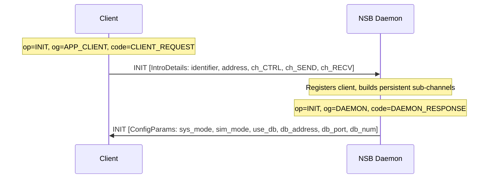
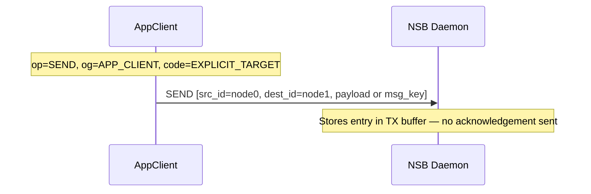
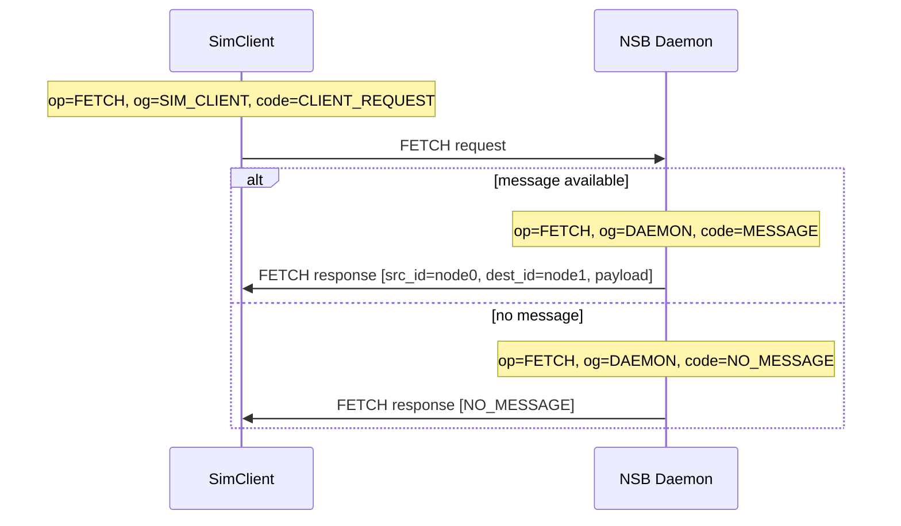
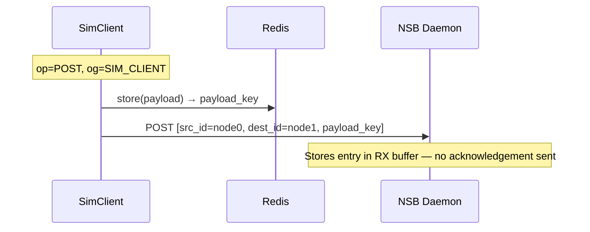
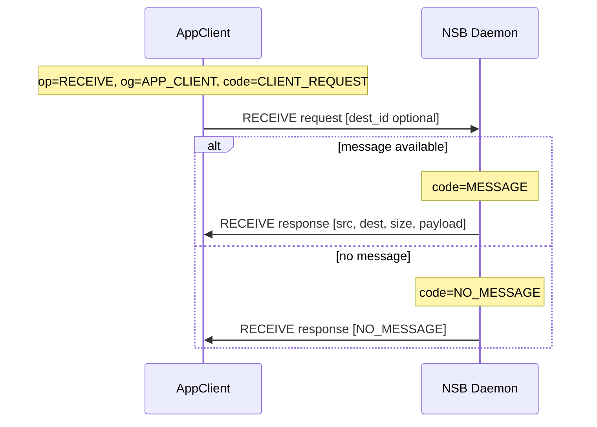

# Initialization Flow

The five typical message flows that occur in NSB, shown with their complete `manifest`, `metadata`, and `message` field values — plus how to construct, serialize, and parse the `nsbm` Protobuf message in both Python and C++.


## 1. Client INIT Handshake




## 2. AppClient SEND




## 3. SimClient FETCH (PULL mode)




## 4. SimClient POST




## 5. AppClient RECEIVE (PULL mode)




## Using the Proto in Python

```python
from proto.proto import nsb_pb2

# Create a message
msg = nsb_pb2.nsbm()
msg.manifest.op = nsb_pb2.nsbm.Manifest.Operation.SEND
msg.manifest.og = nsb_pb2.nsbm.Manifest.Originator.APP_CLIENT
msg.manifest.code = nsb_pb2.nsbm.Manifest.OpCode.CLIENT_REQUEST
msg.metadata.src_id = "node0"
msg.metadata.dest_id = "node1"
msg.payload = b"Hello!"

# Serialize
data = msg.SerializeToString()

# Deserialize
received = nsb_pb2.nsbm()
received.ParseFromString(data)
print(received.metadata.src_id)
```


## Using the Proto in C++

```cpp
#include "nsb.pb.h"

nsb::nsbm msg;
msg.mutable_manifest()->set_op(nsb::nsbm::Manifest::SEND);
msg.mutable_manifest()->set_og(nsb::nsbm::Manifest::APP_CLIENT);
msg.mutable_metadata()->set_src_id("node0");
msg.mutable_metadata()->set_dest_id("node1");
msg.set_payload("Hello!");

// Serialize
std::string serialized;
msg.SerializeToString(&serialized);

// Deserialize
nsb::nsbm received;
received.ParseFromString(serialized);
std::cout << received.metadata().src_id() << std::endl;
```


## Go Deeper

- [Protobuf Schema](/docs/protocol/protobuf-schema) — the full message definition these flows are built from
- [Operations Reference](/docs/protocol/operations) — every `op`/`og`/`code` value used above
- [Payload Lifecycle](/docs/architecture/payload-lifecycle) — these same flows shown as the higher-level PULL/PUSH lifecycle