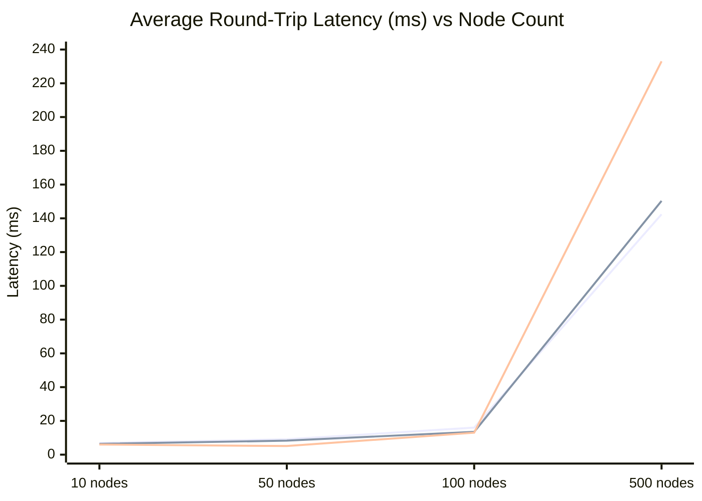
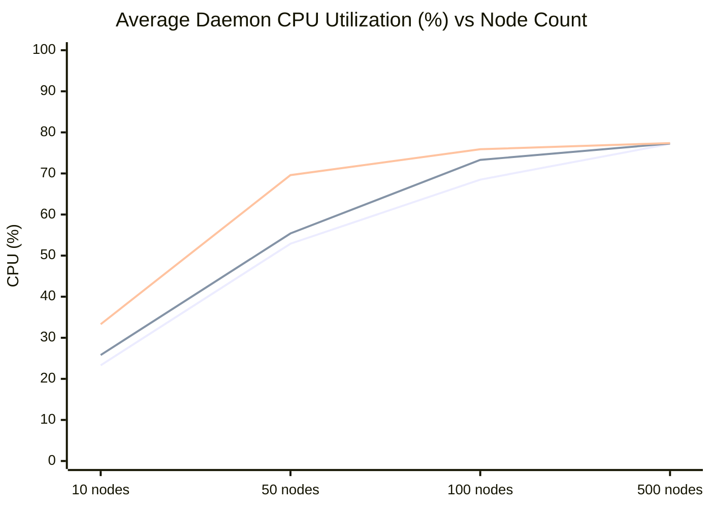
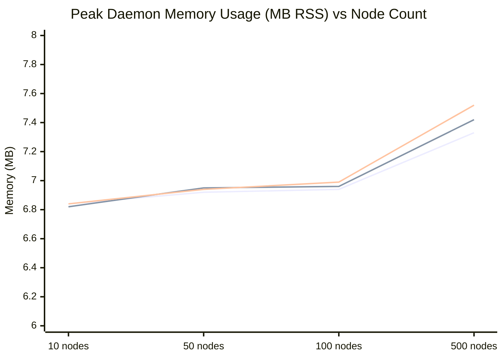

# Performance Evaluation

This page presents the empirical performance evaluation of NSB2, as described in *"NSB2: An Open-Source Modular Pipeline for Application-Network Co-Simulation"* (ACM Middleware 2026). The evaluation demonstrates that NSB2 introduces negligible overhead under practical usage conditions.

## Methodology

### Goal

To measure NSB2's overhead and scalability in isolation — specifically the latency, CPU utilization, and memory usage introduced by the bridge itself, independent of any real network simulator's computational cost.

### Setup

All experiments were run in **PULL mode** to showcase the upper bounds of latency and resource utilization. Each experiment ran for **60 seconds** and was repeated across **five independent sweeps**; results below reflect the averaged aggregate dataset.

A **lightweight ghost simulator client** was used in place of a real network simulator. This ghost client immediately returned fetched payloads back to the framework, allowing measurement of the bridge-side transport, queuing, and relay behavior without conflating results with the execution cost of a detailed network model.

### Test Environment

Experiments were conducted on an isolated machine provisioned via [CloudLab](https://www.cloudlab.us/):

| Spec | Value |
|---|---|
| CPU | AMD EPYC 7402P (24 Cores, 48 Threads) |
| Architecture | x86_64 (Little Endian) |
| Virtualization | AMD-V Supported |
| RAM | 125 GB Total (122 GB Available) |
| Swap | 8.0 GB Total |

### Evaluation Matrix

| Dimension | Values |
|---|---|
| Node pool sizes | 10, 50, 100 nodes (practical) · 500 nodes (stress/extreme) |
| System-wide message rates | 10 msg/s · 100 msg/s · 1,000 msg/s |

Each combination produced a distinct measurement point, covering a total of 12 configurations (4 node counts × 3 rates).

### Metrics

Latency was measured using instrumented Protocol Buffer message definitions that captured timestamps at each stage of the payload's journey. **NSB-incurred latency** is defined as the total daemon-resident time — the sum of the outbound and return daemon-resident intervals — **excluding** the interval when the simulator client holds the payload externally.

Additional metrics:
- **Daemon CPU utilization** (%)
- **Peak daemon memory usage** via Resident Set Size (RSS, in MB)

## Results

### Latency (Average Round-Trip, ms)

| Nodes | 10 msg/s | 100 msg/s | 1,000 msg/s |
|---|---|---|---|
| 10 | 6.9 ms | 6.4 ms | 6.0 ms |
| 50 | 9.1 ms | 8.3 ms | 5.1 ms |
| 100 | 16 ms | 13.5 ms | 13 ms |
| 500 | **142.4 ms** | **150.3 ms** | **233 ms** |

*Lines represent 10 msg/s, 100 msg/s, and 1,000 msg/s respectively. The 500-node spike reflects the file descriptor ceiling — see Analysis below.*

### Daemon CPU Utilization (Average %)

| Nodes | 10 msg/s | 100 msg/s | 1,000 msg/s |
|---|---|---|---|
| 10 | 23.3% | 25.8% | 33.3% |
| 50 | 52.9% | 55.4% | 69.6% |
| 100 | 68.5% | 73.3% | 75.9% |
| 500 | 77.2% | 77.3% | **77.4%** |

*Lines represent 10 msg/s, 100 msg/s, and 1,000 msg/s respectively. CPU caps near 77% at 500 nodes due to file descriptor reconstruction overhead.*

### Peak Daemon Memory Usage (MB, RSS)

| Nodes | 10 msg/s | 100 msg/s | 1,000 msg/s |
|---|---|---|---|
| 10 | 6.84 MB | 6.82 MB | 6.84 MB |
| 50 | 6.92 MB | 6.95 MB | 6.94 MB |
| 100 | 6.94 MB | 6.96 MB | 6.99 MB |
| 500 | 7.33 MB | 7.42 MB | 7.52 MB |

*Lines represent 10 msg/s, 100 msg/s, and 1,000 msg/s respectively. Memory stays nearly flat — confirming the 500-node degradation is a polling bottleneck, not a memory issue.*

## Analysis

### Practical Usage (10–100 Nodes)

For co-simulation scenarios up to 100 nodes at all tested message rates, NSB2 performs well:

- **Latency** remains low and scales sub-linearly — from ~6 ms at 10 nodes to ~13–16 ms at 100 nodes
- **CPU utilization** stays below 76%, scaling sub-linearly with both node count and message rate
- **Memory usage** stays under **7 MB** across all practical configurations and is essentially constant regardless of load

Notably, **average latency decreases as message rate increases** at constant node count. This is consistent with connection-time and system warm-up costs being amortized across more payloads at higher rates.

### Extreme Case (500 Nodes)

At 500 nodes, behavior diverges significantly:

- **Latency skyrockets** to 142–233 ms depending on message rate
- **CPU caps at ~77%**

The root cause is an **operating environment constraint**: NSB2's persistent multi-channel architecture creates **3 sub-channels per client** (ctrl, send, recv). With 500 clients, this means 1,500 active file descriptors — exceeding the OS file descriptor set limit of **1,024** in the test environment.

When this limit is exceeded, the daemon's single-threaded polling mechanism must **negotiate and reconstruct the file descriptor set** on each polling cycle, adding latency to every payload path and increasing CPU consumption. Memory usage is only marginally affected (~7.3–7.5 MB), confirming that the bottleneck is the polling mechanism, not per-payload processing cost.

**This is a known ceiling**, not a fundamental design flaw. The paper identifies this as a target for future improvement: new polling mechanisms within the daemon to handle file descriptor limits more efficiently without compromising performance.

For the architectural root cause of this ceiling, see [Deep Architecture → Multi-Channel Architecture](/docs/architecture/deep-architecture#multi-channel-architecture).

## Key Takeaways

| Metric | Practical Usage (≤100 nodes) | Extreme (500 nodes) |
|---|---|---|
| Average latency | ~6–16 ms | 142–233 ms |
| CPU utilization | < 76% | ~77% (capped) |
| Peak memory | < 7 MB | ~7.5 MB |
| Scaling behavior | Sub-linear | Degraded at FD limit |

**NSB2 is well-suited for co-simulation of systems up to ~100 concurrent nodes** with low latency and a memory footprint under 7 MB. The 500-node case reveals a fixable environmental constraint rather than a fundamental architectural limitation.

## Known Limitations & Ongoing Work

### File Descriptor Ceiling
The current daemon polling implementation uses OS file descriptors to implement the multi-channel persistent architecture. At 3 sub-channels per client, environments with small file descriptor limits (e.g., the default 1,024) hit a ceiling around 340 concurrent clients. The team plans to improve daemon polling mechanisms to handle this constraint more efficiently.

### Multi-Machine Deployments
NSB2's current communication and data infrastructure should support multi-machine (distributed) deployments — Redis can be accessed remotely — but this has not yet been fully tested and optimized. This is an active area of ongoing development.

### Future Improvements (from the paper)
- More adaptable daemon polling mechanism for constrained environments
- Optimization for multi-machine distributed deployments
- Domain-specific adaptations via the modular extension interface

## Go Deeper

- [Deep Architecture](/docs/architecture/deep-architecture) — the multi-channel design that produces this file-descriptor ceiling
- [Background & Related Work](/docs/reference/background-and-related-work) — the academic publication this evaluation is drawn from